# OASA-redesign

Redesigning the website of OASA (Athens' transportation system), focusing on UX Design.  
Made using PHP, SQL, HTML, CSS (Bootstrap) and JAVASCRIPT (Bootstrap, jQuery).

## Usage

```bash
First import the database to phpMyAdmin
$ cd /opt/lampp/
$ sudo ./xampp start
xxx.xxx.xxx.xxx/OASA-redesign/
or
localhost/OASA-redesign/
```

## Contributors
[Chrysostomos Rampidis](https://github.com/chrysr)  

[Konstantinos Paschopoulos](https://github.com/KonstantinosPaschopoulos)

## Screenshots
Front Page  
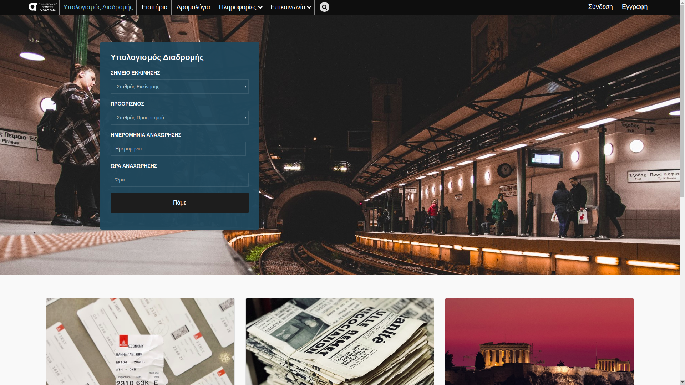  

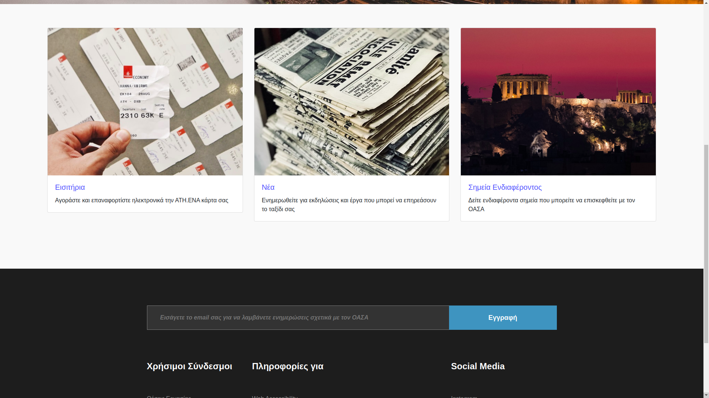

Subscription Modal  
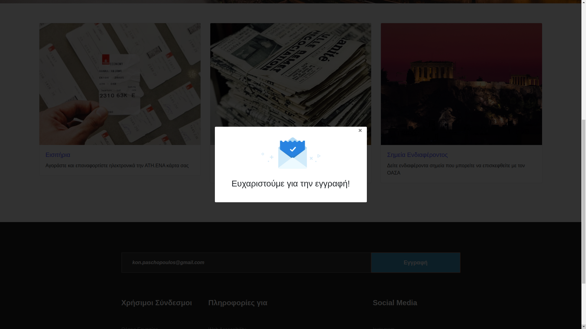

Journey Planner  
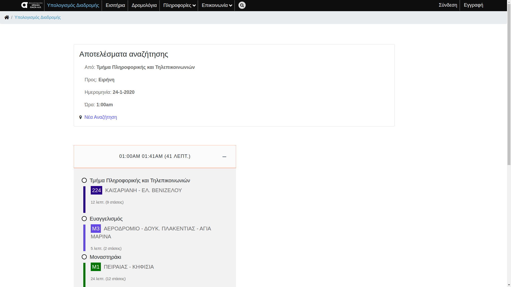

Tickets  
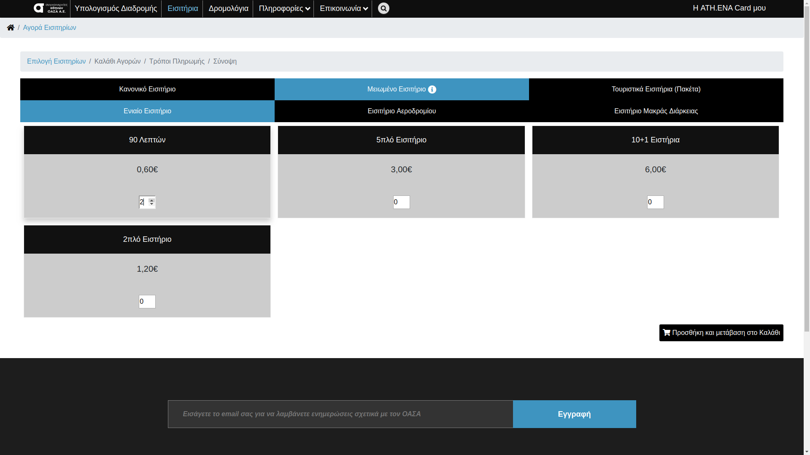  

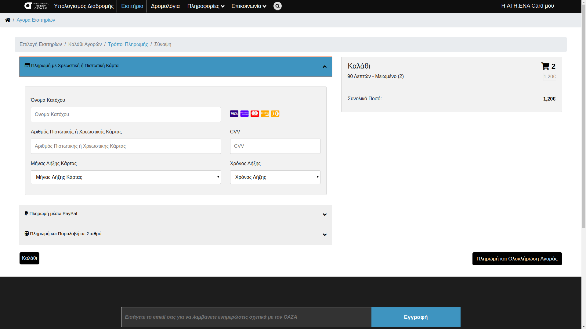

Stations  
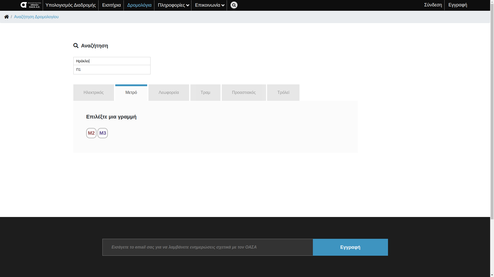

FAQ  
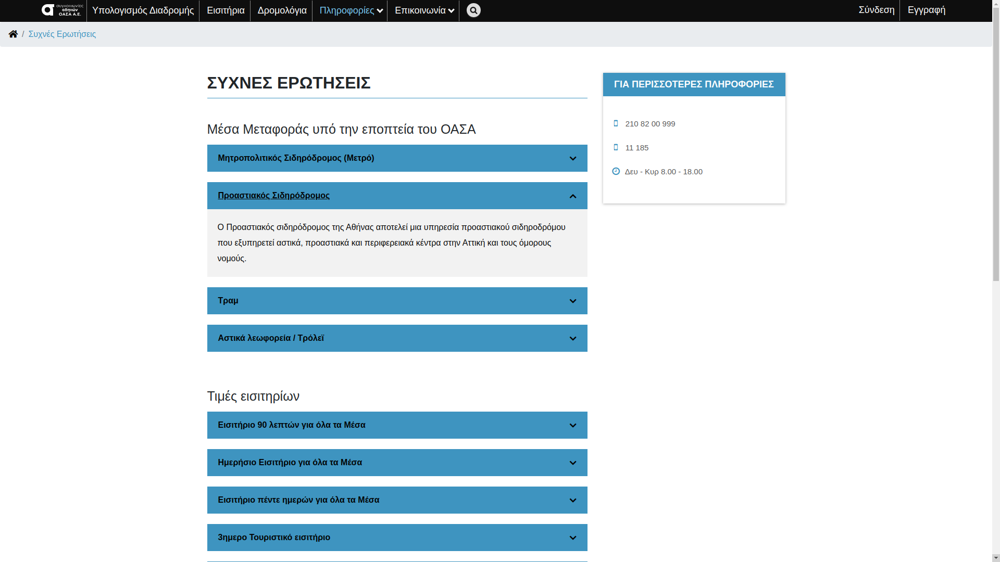

Accessibility Information  
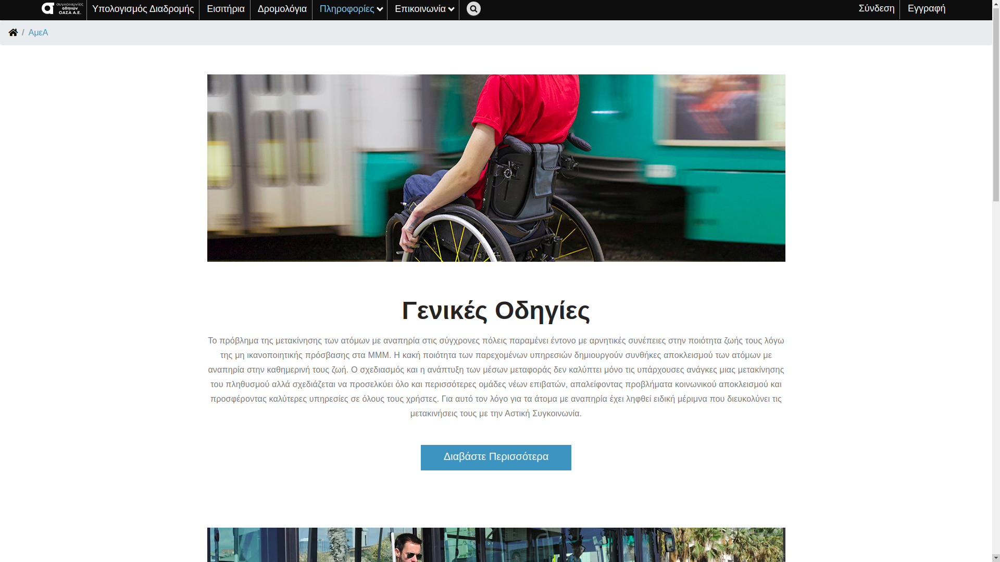  

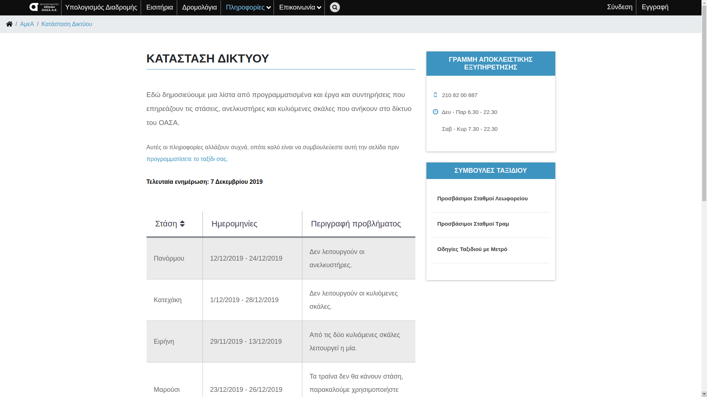

Login  
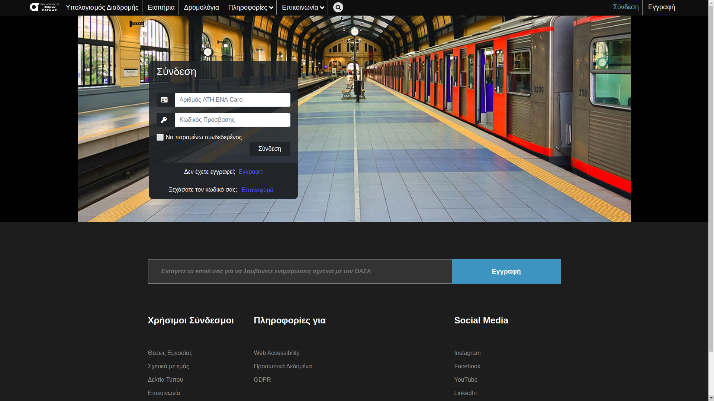

Password Recovery  
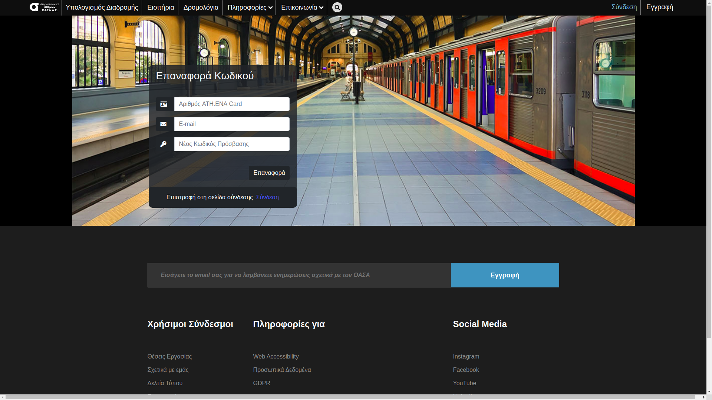

Signup  
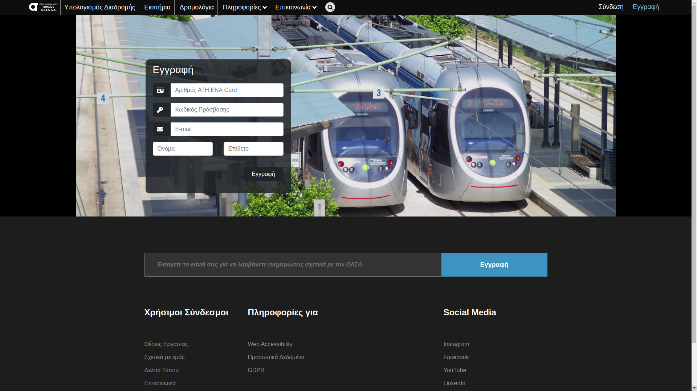

User Dashboard  
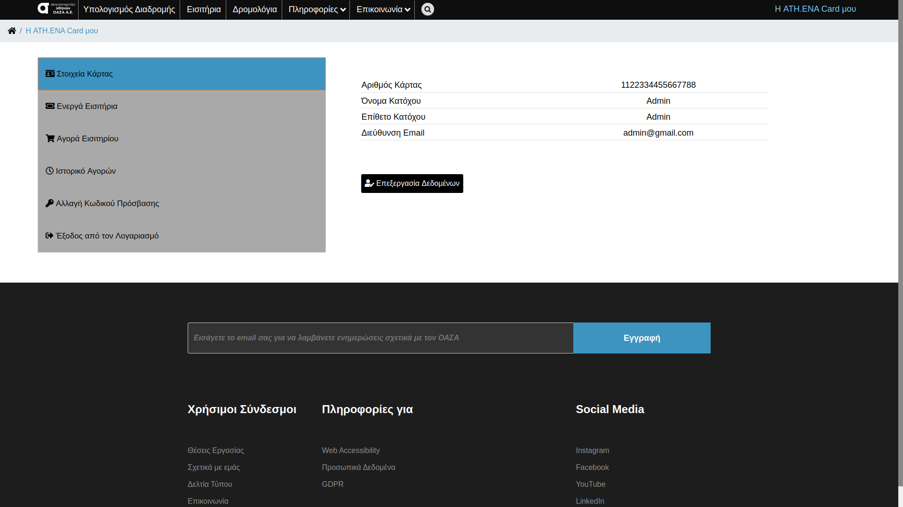  

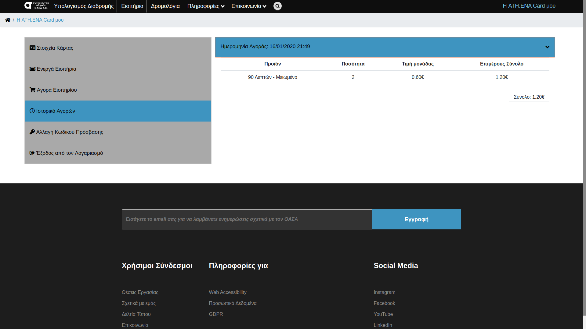